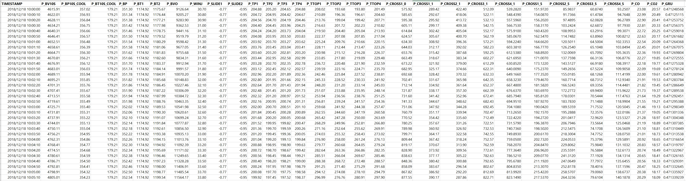
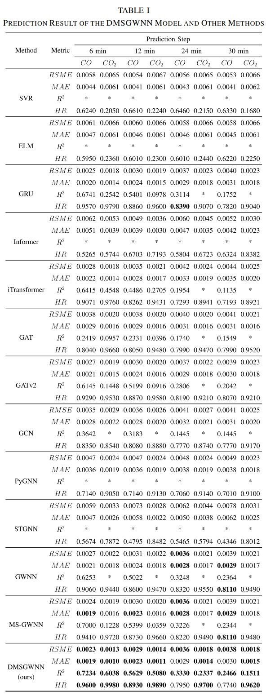
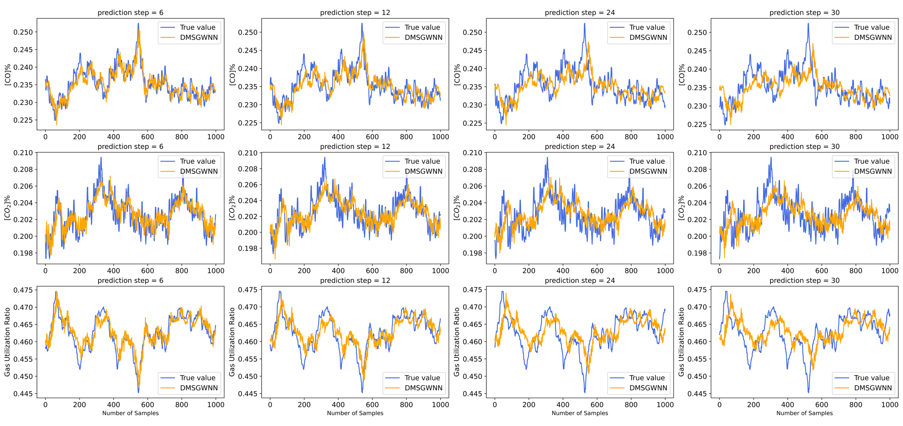

# DMSGWNN: Denoising Multi-scale Spectral Graph Wavelet Neural Networks for Gas Utilization Ratio Prediction in Blast Furnace (TNNLS, 2024)


This is the origin Pytorch implementation of Informer in the following paper: 
[Denoising Multiscale Spectral Graph Wavelet Neural Networks for Gas Utilization Ratio Prediction in Blast Furnace](https://ieeexplore.ieee.org/abstract/document/10684734).

DMSGWNN is a versatile method that can be applied to similar multivariate time series prediction tasks.

We will continue this line of research and update on this repo. Please star this repo and [cite](#citelink) our paper if you find our work is helpful for you.

<p align="center">

<br><br>
<b>Figure 1.</b> The architecture of DMSGWNN.
</p>


## Requirements

- Python == 3.8
- matplotlib == 3.3.2
- numpy == 1.22.0
- pandas == 1.3.5
- scikit_learn == 1.0.2
- scipy == 1.7.3
- torch == 2.0.1
- torch_sparse == 0.6.18+pt20cu117
- torch-scatter == 2.1.2+pt20cu117
- joblib == 1.1.0
- tqdm == 4.64.1

## Usage
After dependencies are installed, commands for training and testing the DMSGWNN model on the test data (`dataSource/data_test.xlsx`):

```bash
python main_GUR_DMSGWNN.py
```

## Data
As the data used in this study originates from actual blast furnace ironmaking processes, it contains numerous operational parameters that are proprietary and confidential to the company. Hence, we are unable to openly share these datasets due to strict confidentiality agreements in place. However, in order to test our code, we randomly generated a batch of fake data (`dataSource/data_test.xlsx` and `dataSource/data_GUR_correlation_matrix_test.csv`) to verify the runnability of our code.

<p align="center">

<br><br>
<b>Figure 2.</b> An example of the blast furnace data.
</p>

## <span id="resultslink">Results</span>

To validate the effectiveness of our proposed method, we compare the DMSGWNN model with several traditional non-DL models, time-series forecasting models, and GNN-based models.

<p align="center">

<br><br>
<b>Figure 3.</b> Comparative results with baseline models.
</p>

<p align="center">

<br><br>
<b>Figure 4.</b> Visualization results of the DMSGWNN model for CO, CO2, and GUR in different prediction horizons.
</p>

<p align="center">

<br><br>
<b>Figure 5.</b> Schematic of the developed GUR prediction system.
</p>


## <span id="citelink">Citation</span>
If you find this repository useful in your research, please consider citing the following papers:

```
@article{liu2024denoising,
  title={Denoising Multiscale Spectral Graph Wavelet Neural Networks for Gas Utilization Ratio Prediction in Blast Furnace},
  author={Liu, Chengbao and Li, Jingwei and Li, Yuan and Tan, Jie},
  journal={IEEE Transactions on Neural Networks and Learning Systems},
  year={2024},
  doi = {10.1109/TNNLS.2024.3453280},
  publisher={IEEE}
}
```

## Contact
If you have any questions, feel free to contact Chengbao Liu through Email (liuchengbao2016@ia.ac.cn) or Github issues. Pull requests are highly welcomed!

## Acknowledgments
Thanks for the computing infrastructure provided by the Industrial Intelligence Technology and System Team, the Institute of Automation of the Chinese Academy of Sciences (CASIA).
At the same time, thank you all for your attention to this work! 
[](https://github.com/liuchb715/DMSGWNN-GUR/stargazers)
